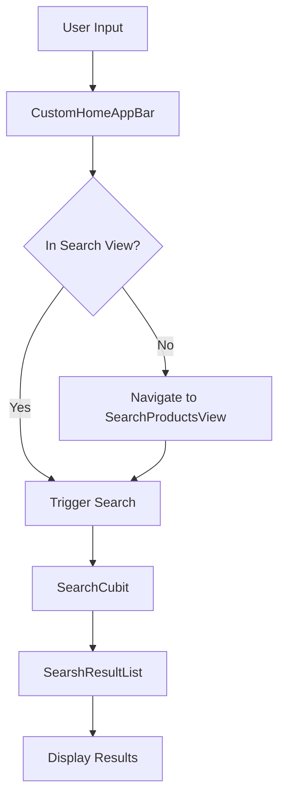

# Search Functionality Documentation

## Overview
The search functionality in the application is implemented through a series of interconnected widgets that provide a seamless search experience. This document outlines the components and their interactions.

## Components

### 1. SearchView
- **Location**: `lib/features/search/presentation/views/search_view.dart`
- **Purpose**: Entry point for the search interface
- **Features**:
  - Creates a `TextEditingController` for search input
  - Provides basic back navigation functionality
  - Wraps the main search interface in a `Scaffold`

### 2. SearchViewBody
- **Location**: `lib/features/search/presentation/views/widgets/search_view_body.dart`
- **Purpose**: Main container for search interface components
- **Parameters**:
  - `searchController`: Required `TextEditingController` for search input
  - `onBackPressed`: Optional callback for back navigation
- **Components**:
  - `CustomHomeAppBar`: Top app bar with search functionality
  - `SearshResultList`: List displaying search results

### 3. CustomHomeAppBar
- **Location**: `lib/core/widgets/custom_home_app_bar.dart`
- **Purpose**: Flexible app bar component
- **Parameters**:
  - `scaffoldKey`: For drawer functionality
  - `searchController`: For search input
  - `onBackPressed`: For back navigation
  - `centerText`: Optional center text
  - `visibleNotification`: Controls notification icon visibility
- **Features**:
  - Dynamic back/menu button
  - Logo/center text display
  - Notification widget
  - Search field
  - Search navigation logic

### 4. SearchProductsView
- **Location**: `lib/features/search/presentation/views/search_products_view.dart`
- **Purpose**: Specialized view for product searches
- **Parameters**:
  - `query`: Initial search query
- **Features**:
  - Bloc-based state management
  - Custom back navigation handling
  - Search result display

### 5. SearshResultList
- **Location**: `lib/features/search/presentation/views/widgets/search_result_list.dart`
- **Purpose**: Displays search results
- **Features**:
  - BlocConsumer for state management
  - Loading states with skeleton animation
  - Error handling
  - Product navigation

## Flow Diagram


## State Management
- Uses `BlocConsumer` for handling search states:
  - `SearchLoading`: Shows loading skeleton
  - `SearchFailure`: Displays error message
  - `SearchSuccess`: Shows search results

## Navigation
- Back navigation is handled through callbacks
- Product selection navigates to `ProductDetailsView`
- Search view maintains its own navigation stack

## Usage Example
```dart
// Basic search view implementation
class SearchView extends StatelessWidget {
  const SearchView({super.key});

  @override
  Widget build(BuildContext context) {
    final searchController = TextEditingController();
    return Scaffold(
      body: SearchViewBody(
        searchController: searchController,
        onBackPressed: () => Navigator.pop(context),
      ),
    );
  }
}
```

## Best Practices
1. Always provide a `TextEditingController` for search input
2. Implement proper back navigation handling
3. Use the `SearchCubit` for state management
4. Handle loading and error states appropriately
5. Maintain consistent UI across different search contexts 